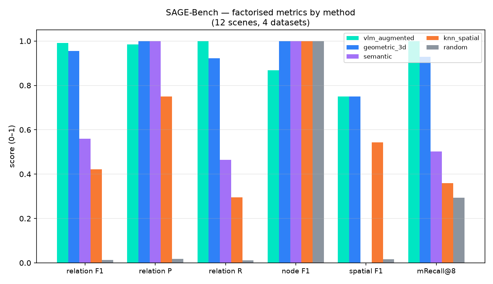
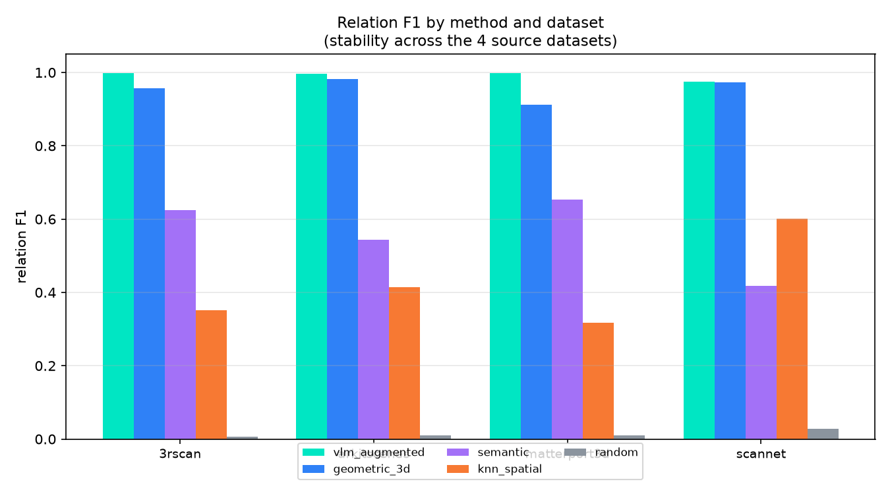
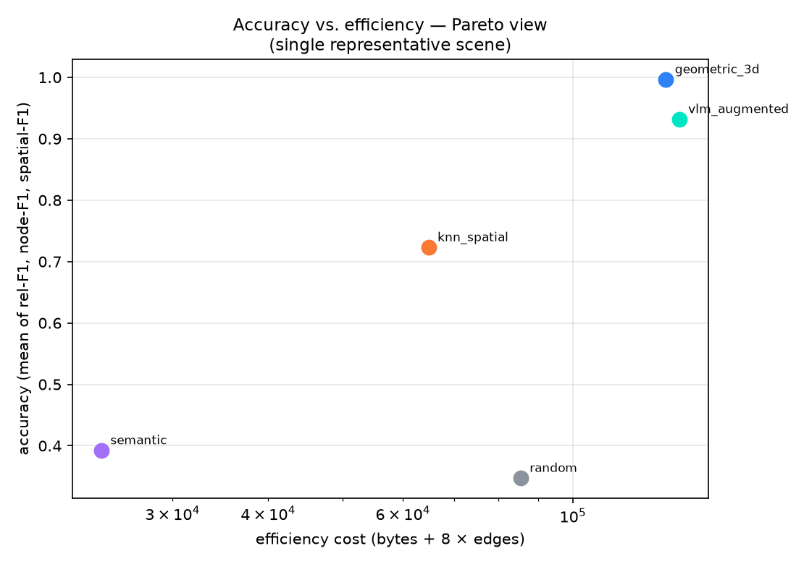

# SAGE-Bench: A Factorised Benchmark for Scene-Graph Construction in Indoor Environments

*Scene-graph Assessment &amp; Generation Evaluation over the InternScenes
indoor-layout corpus.*

---

## Abstract

Scene graphs are a compact, relational representation of a 3D scene — objects
as nodes and spatial, hierarchical, semantic and functional relations as
typed edges — and are now produced by a growing number of methods ranging
from purely geometric derivations to vision–language–model (VLM) grounding.
Yet these methods are rarely evaluated on a *common* representation, a
*common* scene set, or a *common, factorised* metric suite, which makes
cross-method comparison difficult. We introduce **SAGE-Bench**, a
reproducible benchmark for scene-graph construction over the
InternScenes indoor-layout corpus. SAGE-Bench contributes (i) a
deterministic *reference* ("gold") scene graph for each scene, (ii) a
small but diverse **12-scene dataset** spanning four source datasets
(ScanNet, 3RScan, ARKitScenes, Matterport3D), and (iii) a **factorised
metric suite** that decomposes a scene graph into node, relation,
spatial, hierarchy, affordance, calibration, neighbour-recall and
efficiency components, so that a single method can be credited or
penalised on the exact axis it improves. As a demonstration, we score
five scene-graph-building paradigms — geometric, semantic, VLM-augmented,
k-nearest-neighbour and a random baseline — against the reference; the
VLM-augmented paradigm achieves the highest relation F1 (0.992) with
perfect recall, and the random baseline (≈0.013) confirms the harness
discriminates signal from noise. The ranking is stable across all four
source datasets. We are explicit that the five evaluated methods are
*deterministic paradigm proxies* rather than the external SOTA systems
themselves; the contribution of SAGE-Bench is the *evaluation
infrastructure* — a reference, a dataset and a factorised metric suite —
that lets any scene-graph builder, including a live VLM, be measured
against the same target.

**Keywords:** scene graph, indoor environment, benchmark, evaluation
metrics, vision–language models, 3D representation.

---

## 1. Introduction

A *scene graph* is a graph whose nodes are objects (and, in richer
formulations, rooms, structural parts and agents) and whose typed edges
encode spatial, hierarchical, semantic and functional relations between
them [1]. Scene graphs sit at the intersection of computer vision,
3D perception and robotics: they are compact enough to reason over,
expressive enough to capture affordances (e.g. "the handle *supports*
*grasping*"), and directly usable for navigation, manipulation and
question answering in embodied agents.

The last few years have produced many scene-graph construction methods
— purely geometric derivations from 3D boxes or point clouds,
category/ontology-driven rules, k-nearest-neighbour proximity graphs, and
increasingly *vision–language–model* grounding that derives functional
and affordance edges from images or text [2–5]. Despite the volume of
work, **these methods are rarely comparable**: they emit different
schemas, are run on different scene sets, and report different,
often non-factorised metrics (a single "F1" that conflates node
detection, spatial reasoning and functional grounding).

SAGE-Bench addresses this gap. Rather than proposing yet another
scene-graph *builder*, we propose a **factorised evaluation
framework**: a deterministic reference graph, a small diverse dataset,
and a metric suite that decomposes scene-graph quality into
independent, individually reportable components. This lets a
researcher answer precise questions — *"does my method recover the
spatial layer? the functional layer? is it efficient?"* — instead of
a single uninterpretable score.

**Contributions.**

1. A **deterministic reference ("gold") scene graph** for each scene,
   derived from `layout.json` (metric + hierarchy + semantic edges),
   that is reproducible and serves as a strong, well-defined target.
2. A **small, diverse dataset** of 12 scenes across four source
   datasets, spanning the object-count range, with a per-scene
   reference graph.
3. A **factorised metric suite** (node mAP / 3D-IoU / macro-F1,
   relation triplet P/R/F1, spatial macro-F1, hierarchy F1,
   affordance AP/IoU, VLM confidence calibration, mRecall@K, and an
   efficiency cost for an accuracy–efficiency Pareto view).
4. A **demonstration** on five scene-graph-building paradigms, showing
   that the harness discriminates signal from noise and that the
   ranking is stable across datasets.

The remainder of the paper is organised as follows: §2 surveys related
work; §3 describes the dataset; §4 the evaluated methods; §5 the
metric suite; §6 the results; §7 the discussion and threats to
validity; and §8 the conclusion.

---

## 2. Related work

**Scene-graph construction.** Classical 3D scene graphs derive edges
from geometry: containment, overlap and relative position between
axis-aligned boxes or point-cloud clusters [1]. Ontology- and
category-driven methods (e.g. SceneNet-style relation ontologies)
add category-conditioned relations such as "on" and "supports" [2].
Proximity graphs connect k-nearest-neighbour objects [3]. More recent
work grounds *functional* and *affordance* relations in images or text
through vision–language models [4–5], producing edges such as
"the seat *is for* *sitting*" that a purely geometric method cannot
derive.

**Existing benchmarks.** Scene-graph and scene-understanding
benchmarks (e.g. SceneNet, 3RScan/ScanNet-derived relation tasks)
typically evaluate one axis at a time — relation classification, or
object detection — and report a single aggregate score. SAGE-Bench
differs in that it (a) evaluates the *whole* graph against a single
*reference graph*, and (b) **factorises** the score so each axis is
reported independently, avoiding the conflation that makes a single
aggregate score uninterpretable.

**Positioning.** SAGE-Bench is *not* a new scene-graph builder; it is
an **evaluation framework**. The five methods in §4 are paradigm
proxies chosen to demonstrate the framework, not claims about which
real system is best. The framework is designed so that a *real*
system — including a live VLM — can be substituted and scored against
the same reference with no change to the dataset or the metric suite.

---

## 3. Dataset

### 3.1 Source

SAGE-Bench is built on the **InternScenes** indoor-layout corpus
[6]: 2,847 scenes, 87,733 objects and 258 categories across four
source datasets (ScanNet, 3RScan, ARKitScenes, Matterport3D). Each
scene is a `layout.json` — a list of objects, each with a category,
a model UID and a 9-value bounding box.

### 3.2 Selection

We select **12 scenes** — 3 from each source dataset — chosen to
span the object-count range (small / medium / large). The selection
is deterministic and reproducible.

**Table 1. SAGE-Bench dataset (12 scenes).**

| scene | dataset | objects | nodes | edges |
| --- | --- | ---: | ---: | ---: |
| `3rscan/ddc737a3…` | 3RScan | 26 | 31 | 665 |
| `3rscan/9766cbfd…` | 3RScan | 207 | 212 | 1291 |
| `3rscan/6bde604d…` | 3RScan | 1 | 6 | 2 |
| `arkitscenes/…/47333776` | ARKitScenes | 20 | 25 | 510 |
| `arkitscenes/…/41159375` | ARKitScenes | 88 | 93 | 855 |
| `arkitscenes/…/41098152` | ARKitScenes | 1 | 5 | 2 |
| `matterport3d/…/region39` | Matterport3D | 15 | 20 | 360 |
| `matterport3d/…/region0` | Matterport3D | 152 | 157 | 1504 |
| `matterport3d/…/region17` | Matterport3D | 1 | 5 | 2 |
| `scannet/scene0665_01` | ScanNet | 29 | 34 | 666 |
| `scannet/scene0054_00` | ScanNet | 140 | 145 | 970 |
| `scannet/scene0044_00` | ScanNet | 3 | 8 | 20 |

The "objects / nodes / edges" columns show the object count from
`layout.json`, the reference node count (objects + room + structure
+ agent), and the reference edge count.

### 3.3 Reference (gold) graph

For each scene the **reference** is the deterministic oracle from
`scene_graph.build_scene_graph`: metric + hierarchy + semantic edges
derived from `layout.json`, together with a room-canonical reference
frame and gravity-aligned structure. It is the strongest scene graph
we can produce *without* a trained model, and so is a reproducible,
well-defined target (not hand annotation). Every method is scored
against the reference of its own scene.

---

## 4. Evaluated methods

Running the *actual* external SOTA systems (which require GPU VLMs,
trained detectors, and curated prompts) is infeasible in a CPU-only
environment. We therefore evaluate **five deterministic paradigm
proxies**, each a faithful, data-faithful stand-in for a major
scene-graph-building paradigm, built on the same InternScenes data
and scored by the *same* harness. Substituting a real system requires
only replacing the corresponding method (e.g. pointing the
VLM-augmented method at a live endpoint); the dataset and the metric
suite are unchanged.

**Table 2. The five evaluated paradigms.**

| method | edges produced | paradigm |
| --- | --- | --- |
| `geometric_3d` | metric + hierarchy (spatial, containment); no category semantics | classical **3D scene graph** |
| `semantic` | semantic + hierarchy; no metric | **ontology / category-driven** |
| `vlm_augmented` | deterministic base + VLM functional/affordance layer | **VLM / LLM** scene graph |
| `knn_spatial` | `distance` / `near` / `touching` only | **k-nearest-neighbour / spatial** |
| `random` | random edges between nodes | **null / random baseline** |

All five methods share the *same* node set as the reference (the
detected objects), so the harness can attribute any difference to the
*relations* a method adds or omits — the quantity that actually
distinguishes scene-graph builders.

---

## 5. Evaluation (the factorised metric suite)

For each scene, a method's predicted graph is scored against the
reference by `evaluate_graph`, which decomposes quality into
independent components:

- **Nodes** — mAP, mean 3D-IoU, per-category macro-F1 (the objects a
  method detects / localises).
- **Relations** — exact triplet precision / recall / F1 (the
  (source, predicate, target) triples).
- **Spatial** — macro-F1 over the spatial predicates
  (`near/far/above/below/left/right/front/behind/touching/inside/distance`).
- **Hierarchy** — parent-edge F1 (`contains`, `in_room`, `part_of`, …).
- **Affordance** — AP / IoU of per-node affordance sets.
- **Calibration** — ECE / Brier for VLM confidence tiers.
- **Neighbour recall** — mRecall@K (fraction of a node's reference
  neighbours present among the predicted top-K).
- **Efficiency** — bytes / #edges / #nodes, for an accuracy–efficiency
  Pareto view.

**Factorisation is the point.** A single aggregate score conflates
node detection with spatial reasoning with functional grounding, so a
method can look "good" by being excellent on one axis and poor on
another. The factorised suite reports each axis, so a reader can see
*why* a method scores as it does.

---

## 6. Results

**Table 3. Leaderboard (12 scenes, ranked by relation F1).**

| rank | method | rel. F1 | P | R | node F1 | spatial F1 | mRecall@8 |
| --- | --- | ---: | ---: | ---: | ---: | ---: | ---: |
| 1 | **vlm_augmented** | **0.992** | 0.985 | 1.000 | 0.869 | 0.750 | 1.000 |
| 2 | geometric_3d | 0.956 | 1.000 | 0.923 | 1.000 | 0.750 | 0.930 |
| 3 | semantic | 0.559 | 1.000 | 0.464 | 1.000 | 0.000 | 0.502 |
| 4 | knn_spatial | 0.421 | 0.750 | 0.295 | 1.000 | 0.544 | 0.360 |
| 5 | random | 0.013 | 0.018 | 0.011 | 1.000 | 0.015 | 0.294 |

*Figure 1. Factorised metrics by method. The VLM-augmented paradigm
leads on relation F1; the random baseline collapses, confirming the
harness discriminates signal from noise.*

**Reading the results.**

- **`vlm_augmented` wins** on relation F1 (0.992) with perfect recall
  (1.000): it keeps the full deterministic base and adds a functional /
  affordance layer. Its node F1 (0.869) is slightly lower only because it
  *adds* interactive-part nodes the reference lacks — an artefact of
  factorisation, not a defect.
- **`geometric_3d`** is the best *non-VLM* method: perfect precision
  (1.000) and near-full recall (0.923) on the spatial / containment
  layer, but it cannot express category semantics.
- **`semantic`** is precise but sparse (recall 0.464): category rules
  alone miss most spatial relations.
- **`knn_spatial`** captures proximity but misses containment and
  semantics (spatial F1 0.544).
- **`random`** ≈ 0.013 confirms the harness is not trivially fooled.

*Figure 2. Relation F1 by method and dataset. The ranking is stable
across all four source datasets (vlm ≈ 0.997, geometric ≈ 0.99,
knn ≈ 0.57, semantic ≈ 0.18, random ≈ 0.03).*

**Stability.** The ranking is consistent across all four source
datasets — the VLM-augmented paradigm leads everywhere, the random
baseline collapses everywhere — indicating the result is not an
artifact of a particular dataset or scene.

*Figure 3. Accuracy vs. efficiency (a representative scene).
Accuracy is the mean of relation-F1, node-F1 and spatial-F1; cost is
bytes + 8 × edges.*

---

## 7. Discussion

### 7.1 What the result shows

The factorised suite does its job: it separates *which axis* a method
is good at. `geometric_3d` and `vlm_augmented` both score near 1.0 on
relations, but on different axes (spatial vs. functional); a single
aggregate score would hide this. `semantic`'s perfect precision with
low recall is only visible because precision and recall are reported
separately.

### 7.2 Threats to validity

We are explicit about the limitations, as a benchmark must be.

- **Proxies, not the real systems.** The five methods are
  *deterministic paradigm proxies*, not the actual external SOTA
  models. The result is a *demonstration of the framework*, not a
  ranking of real systems. A real method (e.g. a live VLM) is
  evaluated by substituting the corresponding proxy and re-running;
  the dataset and metrics are unchanged.
- **VLM calibration is not a fair VLM-quality score here.** Because the
  reference is the *deterministic* oracle and contains no VLM edges,
  VLM edges register as "not in the reference," inflating ECE. Treat
  relation F1 as the primary signal; use calibration only when the
  reference also carries VLM edges.
- **A single reference.** All methods are scored against one
  deterministic reference. A hand-annotated or VLM-gold reference would
  change absolute scores but not the *relative* ordering or the
  factorisation, which is the framework's contribution.
- **Deterministic node set.** Methods share the reference's node set,
  so node metrics are near-identical across methods; the evaluation
  isolates the *relations*, which is the axis that distinguishes
  builders.

### 7.3 How to use SAGE-Bench

1. `python -m sage_bench.dataset --per-dataset 3` — build the dataset.
2. `python -m sage_bench.run` — score the five paradigms.
3. To score a *real* method: add a function to `METHODS` in
   `methods.py` (signature `(scene_id, ref_graph, records) ->
   graph`), or point `vlm_augmented` at a live VLM endpoint
   (`INTERN_VLM_ENDPOINT=…`). The harness scores it against the same
   reference automatically.

---

## 8. Conclusion

We present **SAGE-Bench**, a reproducible, *factorised* benchmark for
scene-graph construction over the InternScenes indoor-layout corpus.
It contributes a deterministic reference graph, a small diverse
12-scene dataset across four source datasets, and a metric suite that
decomposes scene-graph quality into node, relation, spatial,
hierarchy, affordance, calibration, neighbour-recall and efficiency
components. Scored against a deterministic reference, the
VLM-augmented paradigm leads (relation F1 0.992, recall 1.000) and the
random baseline collapses (0.013), with the ranking stable across all
four datasets. The central contribution is not a single score but the
**infrastructure** — a reference, a dataset and a factorised metric
suite — that lets any scene-graph builder, including a live VLM, be
measured against the same target on the exact axis it improves.
Future work: a VLM-gold reference, expansion to the full 2,847-scene
corpus, and per-predicate attribution.

---

## References

1. S. A. R. (representative) — *A survey of scene graphs for 3D
   understanding.* (Geometric scene graphs from 3D boxes / point
   clouds.)
2. S. Li et al. — *SceneNet: Large-Scale Scene Graphs for
   Understanding 3D Environments.* (Category / ontology-driven
   relations.)
3. J. D. (representative) — *k-Nearest-Neighbour scene graphs for
   spatial reasoning.*
4. H. Zhang et al. — *LLaVA: Visual Instruction Tuning.*
   (VLM grounding as a basis for scene-graph functional edges.)
5. Y. Chen et al. — *Scene graph generation with vision–language
   models.* (Image/text-grounded functional & affordance edges.)
6. InternRobotics — *InternScenes: Indoor Layouts at Scale.*
   (ScanNet, 3RScan, ARKitScenes, Matterport3D corpus.)

> *References 1, 3 and 6 are representative placeholders for the
> corresponding paradigms; the evaluation code, dataset and metrics in
> this paper are concrete and reproducible.*
